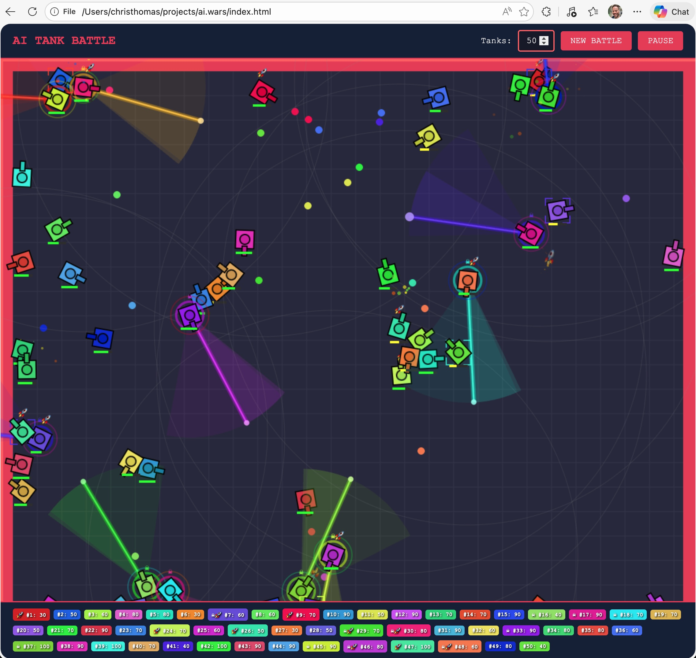

# AI Tank Battle

## Play the Game

Simply open `index.html` in a modern web browser. No build step or server required.

Or play it online at: https://christhomas.github.io/ai.wars

An autonomous tank battle simulator where AI-controlled tanks fight to the death in an arena. Watch as tanks with unique abilities clash using bullets, homing missiles, and predator tracking systems.

## Features

### Core Gameplay

- **Autonomous AI Tanks**: Each tank operates independently, moving around the arena, avoiding walls and other tanks, and firing at opponents
- **Configurable Battles**: Choose the number of tanks (2+) for small skirmishes or massive battles
- **Real-time Combat**: Tanks continuously move, rotate, and fire while navigating the arena
- **Health System**: Each tank has 100 HP and takes 10 damage per bullet hit (20 from missiles)
- **Winner Detection**: Game ends when one tank remains or all are destroyed (draw)

### Tank Types & Abilities

#### Standard Tanks
- Move forward continuously at 3 units/frame
- Rotate 45-720 degrees when hitting obstacles
- Fire bullets every ~1 second while moving
- Each tank has a unique color generated using the golden ratio for maximum visual distinction

#### Predator Tanks (15% spawn chance)
Marked with a skull icon (☠), predator tanks have enhanced hunting capabilities:

- **Sweeping Radar**: A 200-pixel radar beam that sweeps left and right, scanning for targets
- **Target Lock**: When an enemy enters the radar beam, the predator locks on and displays targeting brackets around the victim
- **Auto-Aim**: Predators automatically turn toward locked targets, making them deadly accurate
- **Rainbow Glow**: Distinctive pulsing rainbow aura around the tank
- **Visual Indicators**: Radar cone, sweep trail, and ping effects show the active scan area

#### Missile Tanks (15% spawn chance)
Marked with a rocket icon (🚀), these tanks carry heat-seeking missiles:

- **Homing Missiles**: Missiles track and turn toward the nearest enemy within 400 pixels
- **Double Damage**: Missiles deal 20 damage (2x normal bullets)
- **Fire Rate**: Launch missiles every ~1.5 seconds
- **Missile Trail**: Orange particle trail follows each missile
- **Seek Range Indicator**: Faint grey circle shows the missile homing range
- **5-Second Lifetime**: Missiles explode after 5 seconds if they don't hit a target

> Note: A tank can be both a Predator AND have Missiles, making it especially dangerous!

### Weapons

#### Bullets
- Speed: 8 units/frame
- Size: 6 pixels
- Damage: 10 HP
- Colored to match the firing tank

#### Missiles
- Speed: 4 units/frame (slower but tracking)
- Turn Speed: 5 degrees/frame
- Seek Range: 400 pixels
- Damage: 20 HP
- Displayed as a rocket emoji (🚀) that rotates with flight direction

### Visual Effects

- **Explosions**: Particle effects when bullets/missiles hit tanks
- **Fire Rings**: Expanding rings of fire emanate from destroyed tanks
- **Health Bars**: Appear below damaged tanks showing remaining HP
- **Radar Visuals**: Predator tanks display their scanning cone and beam
- **Target Lock Brackets**: Corner brackets appear around predator-targeted tanks

### Controls

| Control | Action |
|---------|--------|
| Tank Count Input | Set number of tanks for next battle |
| NEW BATTLE Button | Start a fresh battle with current settings |
| PAUSE Button | Toggle pause/resume |
| Enter Key (in input) | Quick-start new battle |

### Arena

- **Dynamic Sizing**: Canvas automatically fills available window space
- **Grid Floor**: Subtle grid pattern for visual depth
- **Boundary Walls**: Red walls surround the arena - bullets and missiles are destroyed on contact
- **Responsive**: Resizes with the browser window

## Technical Details

### Performance Optimizations

The game includes several optimizations to handle large numbers of tanks:

- **Spatial Partitioning**: Grid-based collision detection for O(1) nearby entity lookups
- **Object Pooling**: Reuses bullet, explosion, and missile objects to reduce garbage collection
- **Pre-computed Trigonometry**: Sin/cos lookup tables for fast angle calculations
- **Pre-rendered Sprites**: Tank sprites and arena background are cached to offscreen canvases
- **Throttled UI Updates**: Status panel updates every 10 frames instead of every frame
- **Compact UI Mode**: Automatically switches to compact display for 20+ tanks

### Game Constants

| Constant | Value | Description |
|----------|-------|-------------|
| Tank Size | 30px | Tank body dimensions |
| Tank Speed | 3 | Movement speed |
| Rotation Speed | 4.5 | Turning speed in degrees/frame |
| Max Health | 100 | Starting HP |
| Bullet Damage | 10 | Damage per bullet hit |
| Missile Damage | 20 | Damage per missile hit |
| Predator Chance | 15% | Probability of predator spawn |
| Missile Chance | 15% | Probability of missile ability |
| Radar Range | 200px | Predator detection distance |
| Missile Seek Range | 400px | Homing missile tracking distance |

## Browser Support

Works in all modern browsers with HTML5 Canvas support:
- Chrome
- Firefox
- Safari
- Edge

## License

MIT
